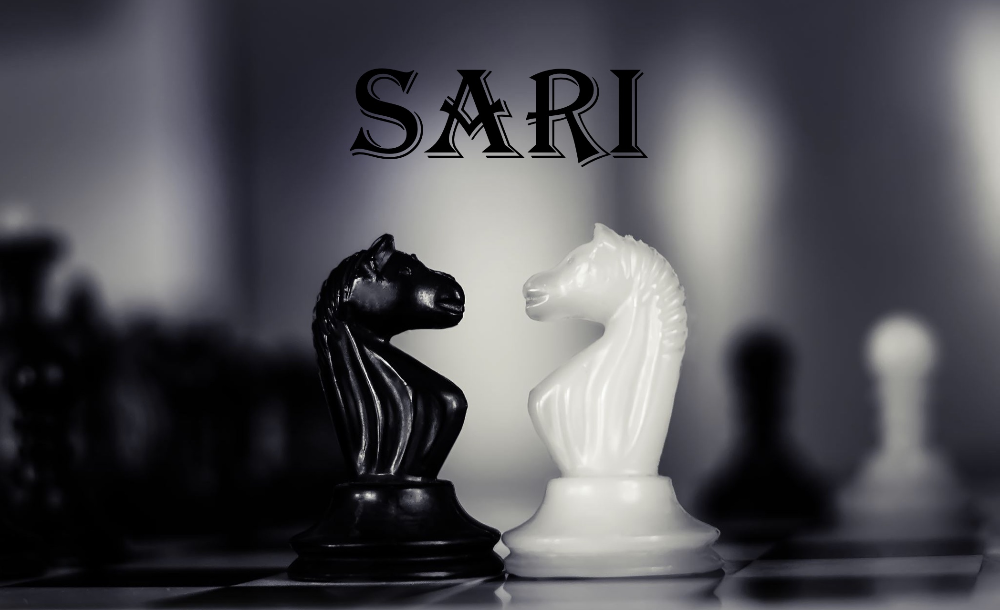
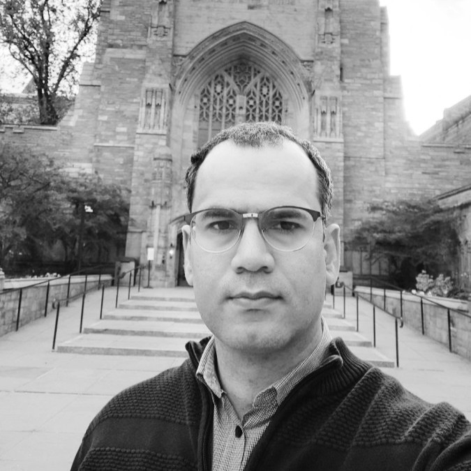
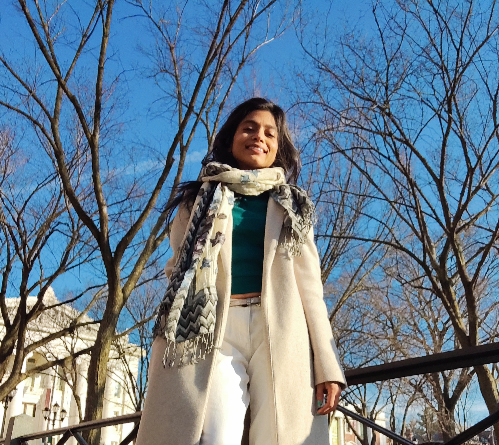
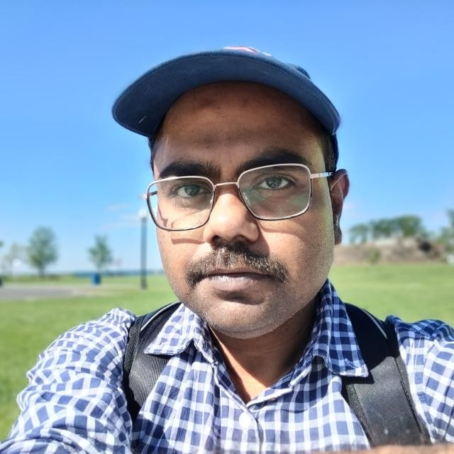
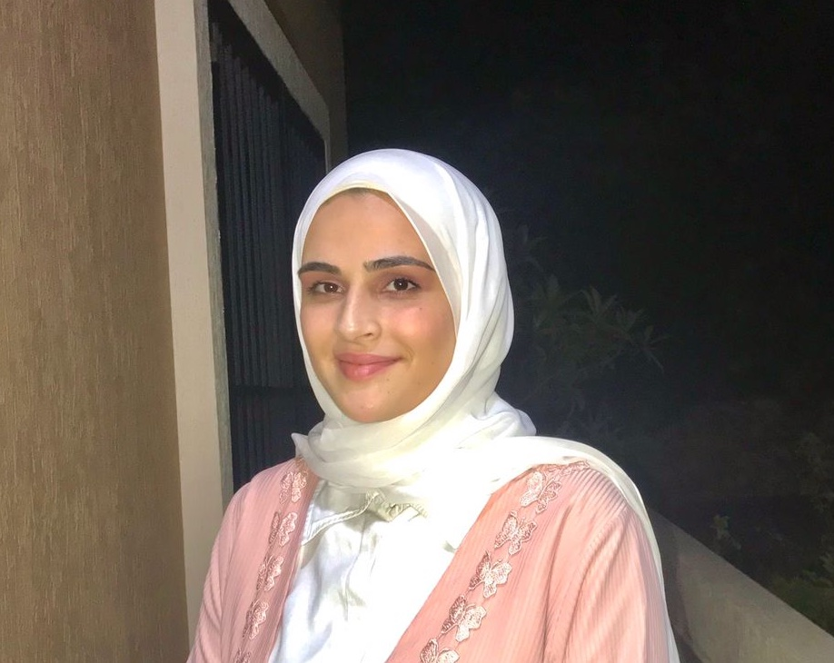
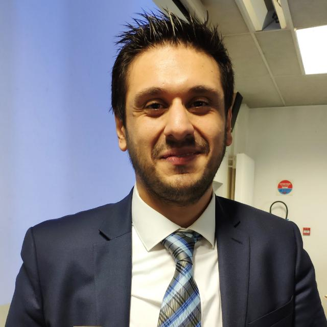
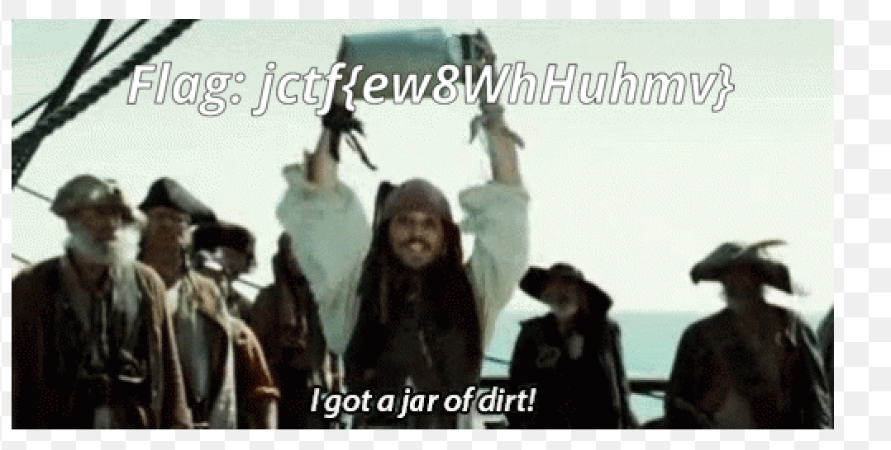
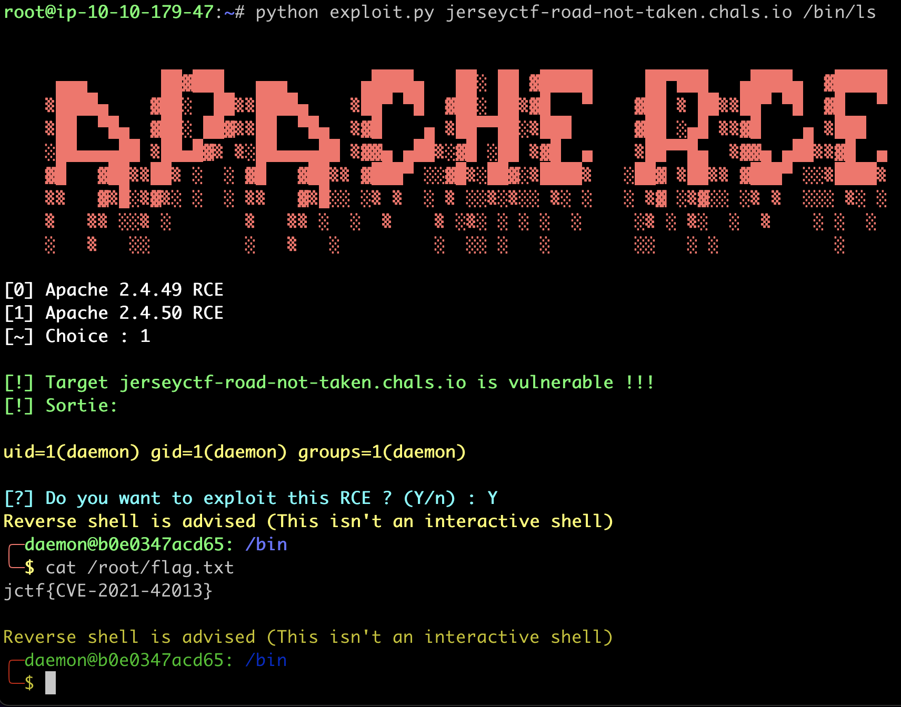

## SARI -- Security & ARtificial Intelligence Lab 

### Welcome to SARI: Security and ARtificial Intelligence Lab at University *of* New Haven. 

**SARI** is the ultimate space for students and professors to work on research projects together! The lab aims at fostering students’ interest and participation in research projects.
Our research objectives are centered around the following thrusts:

- Modeling more resilient IoT systems, cloud and wireless sensor technology toward cyber-attacks using cryptography, Artificial Intelligence (AI), and data analytics.
- Reverse engineering, malware analysis, and cyber forensics.
- AI security and trustworthiness, and AI applications in cybersecurity.

We believe in actively engaging students and pursuing research that encourage diversity and inclusion. *“We lead the lab and we set the lab culture”*.

### Team Members

|  <!-- --> |  <!-- --> |
|:---------:|:---------:|
|  | |
| [**Mohamed Nassar**](https://www.linkedin.com/in/nassar1/) is assistant professor at the University *of* New Haven. His research interests are cybersecurity and machine learning. | [**Shivanjali Khare**](https://www.linkedin.com/in/shivanjalikhare/) is assistant professor at the University *of* New Haven. Her research interests are modeling more resilient IoT and sensors technology toward cyber-attacks using Cryptography and Artificial Intelligence. |
|  |  |
| [**Rajdeep Bhattacharya**](https://www.linkedin.com/in/rajdeepbhattacharyakolkata/) is a graduate student pursuing a computer science degree at the University *of* New Haven. He is interested in integrating AI in the domain of cybersecurity. | [**Acil Farhat**](https://www.linkedin.com/in/acil-farhat-9452171a0/) is graduate research assistant pursuing a master degree in cybersecurity at the University *of* New Haven. She is interested in homomorphic cryptography and Microsoft SEAL. |

### Collaborations 

 

[Yehya NASSER](https://www.linkedin.com/in/yehya-nasser-phd/), Associate Professor, IMT Atlantique, France. Hardware Security & Embedded AI.

### Teaching

- [Ethical Hacking Course](EH-course/Ethical Hacking Course.pdf)
- [Deep Learning Handbook](https://mnassar.github.io/deeplearninghandbook/)

### Current Research Projects 

- Explainable Malware Classification
- AI Fairness for Network Flow Monitoring
- Deep Learning Reverse Engineering

### Recent Program Committee

Team members serve as program committee members at renown international conferences and workshops. 
- [IOTSEQ](https://www.sitis-conference.org/2022/contribute/workshops/iotseq/) Co-hosted with SITIS 2022.
- [BCCA](http://intelligenttech.org/BCCA2022/)
- [IEEE BC4TAI 2022](https://sites.google.com/view/ieee-bc4tai-2022/)

### Recent Publications 

- Carlson, A., **Khare, S.,** Dutta, I.K., Ghosh, B. and Totaro, M., 2022, January. Space Selection and Abstraction in Set Theoretic Estimation. In 2022 IEEE 12th Annual Computing and Communication Workshop and Conference (CCWC) (pp. 0012-0020). IEEE.
- Ghosh, Bhaskar, Indira Kalyan Dutta, **Shivanjali Khare**, Albert Carlson, and Michael Totaro. "Isomorphic cipher reduction." In 2021 IEEE 12th Annual Information Technology, Electronics and Mobile Communication Conference (IEMCON), pp. 0947-0953. IEEE, 2021.
- D. A. Bared and **M. Nassar**, [Segmentation Fault: A Cheap Defense Against Adversarial Machine Learning](https://ieeexplore.ieee.org/document/9678308), 2021 3rd IEEE Middle East and North Africa COMMunications Conference (MENACOMM), 2021, pp. 37-42, doi: 10.1109/MENACOMM50742.2021.9678308.
- Sara Hajj Ibrahim and **M. Nassar**, [Hack The Box: Fooling Deep Learning Abstraction-Based Monitors.](https://sites.google.com/view/ai4an2021/accepted-papers)

### LeetCode 

Team members enjoy solving leetcode puzzles. 

Check our custom solutions to leet code puzzles
[Daily LeetCode](leetcode/leetcode.md)

### Hack The Box 

Team members enjoy pwning Hack The Box machines. 
Take a look at our [mini-walkthroughs](htb/htb.md). The idea is to represent each box as a tree of hints in a very compact manner. No need to go through lengthy tutorials. 

### TryHackMe

Some team members enjoy hacking THM Rooms. 

### CTF 

Some team members enjoy participating at Catch-The-Flag events. We compete under [UNHFlagPhishers](https://ctftime.org/team/177610/#.Ylca8Pbkvbs.link).
We plan to have a flag gallery to display some flag pics. 

|  <!-- --> |  <!-- --> |
|:---------:|:---------:|
|  |  |

### Sibling Labs

[UNHcFreg](https://www.unhcfreg.com/)

[SAIL](http://sail-lab.org/)

[LASER](https://laser.newhaven.edu/)

### Join or Contact

If you are interested in joining our group or just have a chat, you are invited to fill the following form.

<iframe width="640px" height="480px" src="https://forms.office.com/Pages/ResponsePage.aspx?id=q8txPO21O0-sDZVQnWwOkxC0wQj2rzhJq48KWPxfcjZUMUdNUThNUk1XVlVVUExIOFBKQzRRTTRXRS4u&embed=true" frameborder="0" marginwidth="0" marginheight="0" style="border: none; max-width:100%; max-height:100vh" allowfullscreen webkitallowfullscreen mozallowfullscreen msallowfullscreen> </iframe>

Feel free to add us on Linkedin [Nassar](https://www.linkedin.com/in/nassar1/), [Shivi](https://www.linkedin.com/in/shivanjalikhare/) or send an email [Contact Us](mailto:mnassar@newhaven.edu).

